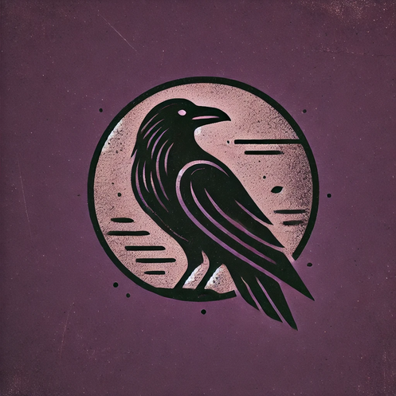

# Crows No Claws



Crows No Claws is a simple chess engine that is being developed by a complete begginer at the topic. The name was choosen with the intention to represent how limited the engine is (after all, what would a crow with no claws be able to do?).

## How to compile
(first download the repo, unzip it and ``cd CrowsNoClaws`` into it)
1.Run the following command:
```bash
gcc -Wextra -Wpedantic -Wall -Werror -o build/CrowsNoClaws.exe -Iincludes -Iatk_gen/kindergarten crowsnoclaws.c src/board.c src/move_generator.c src/constant.c src/atk_gen/kindergarten/kindergarten.c src/atk_gen/atk_gen_helpers.c -O3
```
 Then run the executable: `./build/CrowsNoClaws.exe`
2. Download from the releases option (not yet released).

## Massive thanks to
<span style="color: #666; opacity: 0.7;">no particular order btw :eyes:</span>
1. [Tsoj and his Nalwald engine](https://github.com/tsoj/Nalwald)
2. [Chess Programming Wiki and the CPW discord server](https://www.chessprogramming.org/)
3. [Martin and his engine](https://github.com/martinnovaak/motor/)

### TODO

- [x] Simple board representation
    - [x] Initialize board
    - [x] Print board
- [ ] Add move generator
    - [x] Slider
    - [ ] Legal Moves
    - [ ] Castling
    - [ ] En Passant
    - [ ] Promotion
- [ ] Improve board
    - [ ] Higher level representation for 32bit systems compatibility 
    - [ ] Optimize code
- [ ] Implement eval
    - [ ] Centipawn eval - varying knight and bishop value
    - [ ] Normal eval
    - [ ] NNUE eval
- [ ] Move Ordering
- [ ] Implement search
    - [ ] Alpha-Beta
    - [ ] Monte Carlo
- [ ] Basic UCI
- [ ] Implement UI
    - [ ] CLI
    - [ ] GUI
